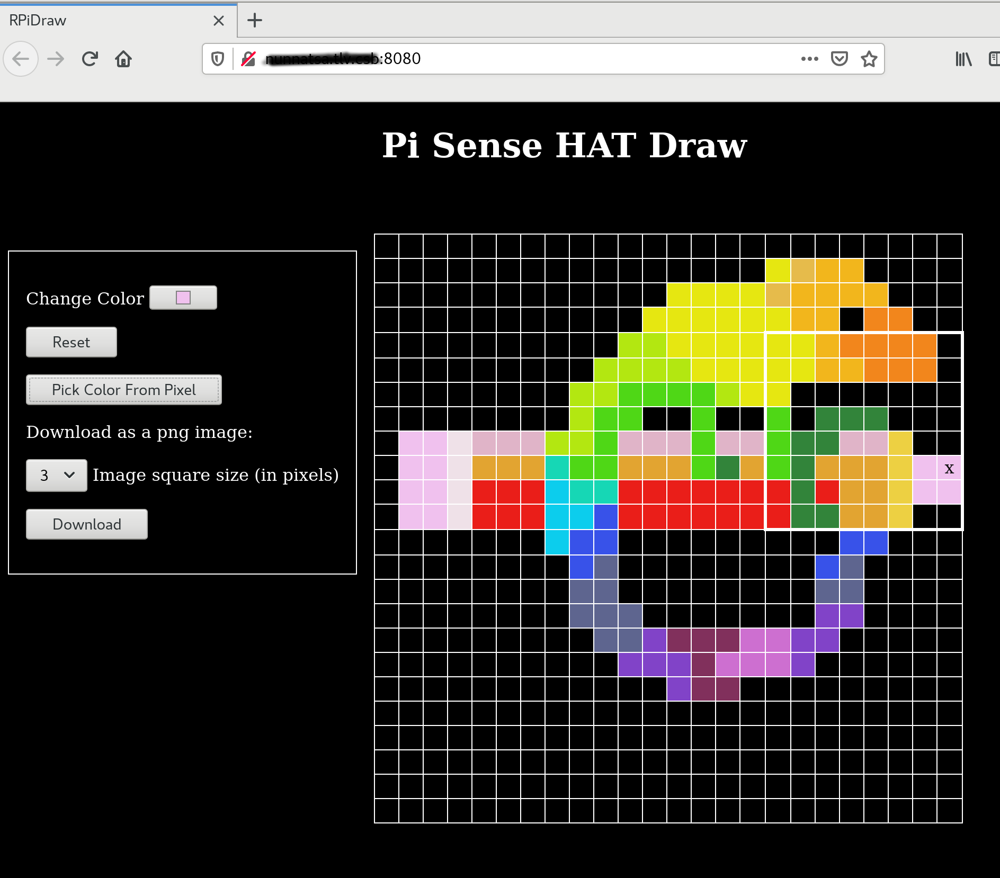

# PiHATDraw
RasberyPi [Sense HAT](https://www.raspberrypi.org/products/sense-hat/) is a device that is connected to a raspberry Pi
and includes several additional hardware and sensors. Two of them are a 8X8 LED display and a joystick.

This software should run on a raspberry pi with a hat. It uses the hat to draw: the display is a "floating" window - a
subset of the bigger canvas. To draw, move the cursor to the required pixel and press the joystick to set the pixel.

The software also starts a web application that serves an HTML page to display the full draw. The cell with the `X` is
the cursor location.

The web display also include the following controls:
- Color picked - to change the color of the cursor: pressing the joystick will set the pixel to this color.
- The `Reset` button: clear the draw, set the cursor and the window to their default position and the color to the
  default color.
- `Pick Color From Pixel` - change the color to the color of the color of the cell that the cursor is pointing to.
- Download Image:
  - Select the download image "pixel" (square) size in real pixels. Choose between 1, 2, 3 (default), 5, 10 or 20
    (original size) pixels.
  - `Download` button to download the image file.
    
###### The HAT during drawing. It only display part of the full picture:


###### The Webapp


## How to Build and Run
I checked this on raspberry pi 2B with a [Sense HAT](https://www.raspberrypi.org/products/sense-hat/), with golang
version 1.15.8

Just installing golang on raspberry pi will give you an old version of go. Better way is to download and install the
latest version:

Got to [golang download page](https://golang.org/dl/) and get the file for armv6l. Currently it's
[go1.15.8.linux-armv6l.tar.gz](https://golang.org/dl/go1.15.8.linux-armv6l.tar.gz)

You can use the instructions [here](https://pimylifeup.com/raspberry-pi-golang/) for the installation.

After that, clone this project in a directory in your go path, e.g. `~/go/src/github.com/nunnatsa`:
```shell
git clone https://github.com/nunnatsa/piDraw.git
```

Now build the software:
```shell
cd piDraw
go build .
```

If everything went fine, the new piDraw executable file is created. Go on and run it:
```shell
./piDraw
```

You can now draw with the HAT joystick on the HAT display.

When on the same network as your raspberry pi, open a web browser and go to your raspberry pi hostname in port 8080, the
default is [http://raspberrypi:8080/](http://raspberrypi:8080/)

Now you can see the full drawing. Notice that the page is sync with the HAT. Open another tab or browser and noticed
that both of them are updated simultaneity.

### Command line parameters:
The software support 3 optional parameters:
* `--port` - to override the default `8080` webapp port.
* `--width` - the canvas width in unit of windows (8-pixels); e.g. setting 3 will produce width of 24. The default is 3,
  and the valid values are 1 - 5.`--width` - the canvas width in unit of windows (8-pixels); e.g. setting 3 will produce
  width of 24. The default is 3, and the valid values are 1 - 5.
* `--height` - the canvas height in unit of windows (8-pixels); e.g. setting 3 will produce height of 24. The default is
  3, and the valid values are 1 - 5.`--width` - the canvas width in unit of windows (8-pixels); e.g. setting 3 will
  produce width of 24. The default is 3, and the valid values are 1 - 5.

### Running not from Raspberry Pi
It is also possible to run from a PC (only tested on Linux). Instead of the joystick, use the arrow keys to move the 
cursor and `Enter` key to paint the pixel.

## The Software
See [here](docs/ARCHITECTURE.md).