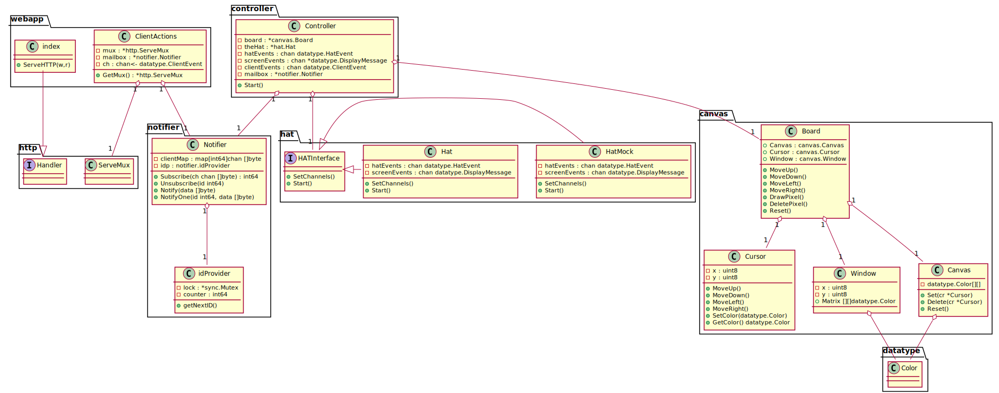

# Software Architecture
## General Description
The architecture of this software is using the event-driven approach, in order to be able to support multiple displays 
with from multiple types. There is a complete seperation between the event generators, event consumers and the software 
state. 

The HAT joystick produces 5 type of events (Move up, down, left or right, and pressing). The HAT sends these events to a
dedicated channel. The HAT display is listening to another channel, with a display events. These events contain the required 
matrix to be displayed, and the relative location of the cursor.

The Canvas is the in memory storage for the picture.

The webapp present the simple HTML page. When the client open this page, a javascript script opens a websocket with the 
web application. This connection stays open for continuous messaging from the webapp.

When opening the websocket, the webapp registers the connection as a channel in the notifier.

The controller is responsible to coordinate everything. It receives the joystick events and modifies the canvas accordingly, 
then triggers an event with the floating window content and the location of the cursor, by sending this information to the 
HAT display channel. The HAT display reads these message from the channel and update the HAT physical display accordingly.

In addition, the controller publishes an event using the notifier with full canvas data, the cluster location, and the floating window location. 
The notifier then sends the message to all the registered client - meaning the open websockets, or the active clients in other words.

The javascript in the HTML keep reading these messages and updates the web display.

The webapp also provides three APIs: 
* `POST /api/canvas/reset` to reset the picture
* `POST /api/canvas/color` to change the cursor (the pen) color
* `GET /api/canvas/color?pixelSize={pixelSize}` to download the image as a png file.

The javascript script uses these APIs when the user press buttons in the web page.
The webapp, when handling these APIs, triggers a client action event - which is a message in the client action channel.
Again, the controller reads these messages from this channel, modifies the canvas and produces the same events as done in 
joystick events

The download event contains a callback channel, so the controller sends the canvas metrics back to the request
handler. The request handler waits to this data, and then it generates a PNG image and send it back to 
the web client.

The software uses the https://github.com/nathany/bobblehat packages in order to perform the HAT hardware related
functionality.

## Class Diagram
golang is not an object-oriented language, and does not support classes, but class diagram is a good way to
describe the components and the relations between them.

## Components
### Hat
The `Hat` struct wraps the [Sense HAT go-driver](https://github.com/nathany/bobblehat). This is the place where the 
hardware/software connection is performed. The `Hat` struct performs two independent activities:
* listen to the hardware joystick event and update the controller for each joystick event using a go channel.
* listen to display events by consuming messages from the `screen` channel. Upon receiving of a display message the Hat 
  updates the 8X8 LED display in the physical HAT.

### Board
The `Board` is the in memory storage that holds the current software state. It contains the following:
* canvas - a matrix of "pixels". The information in the matrix cells is the pixel color (default is black, to match the 
  physical HAT default of turned off LED).
* cursor - the location of the cursor, and its color (the "pen" color).
* window - the location of the floating window in the full canvas. The window is a 8x8 matrix that is a subset of the
  canvas, and it represents the HAT display.
  
### Notifier
The `Nofitier` is an in-memory very simple publish-subscribe mechanism. (internal) Client can subscribe to the notifier.
The controller uses the notifier to publish display change messages for web clients. The notifier then sends these messages
to all the subscribers.

### Webapp
The webapp is responsible for the web display. It publishes a single HTML page as the index of the webapp (path `/`).

The webapp also contains several API handlers:
* `/api/canvas/register` - this API is called from the web client when it loaded. This is a request to open a websocket. 
  This socket remains open until the web browser is closed. The handler subscribes to the notifier, and upon receiving a
  web display messages, it updates the web client using a websocket message.
* `POST /api/canvas/color` - changes the cursor (pen) color, by sending a client request to the controller
* `POST /api/canvas/reset` - delete the software state and creates an empty one (delete reset the image) by sending a 
  client request message to the controller.
* `GET /api/canvas/download?pixelSize={1,2,3,5,10 or 20}` - generates a PNG file and send it to the web client as response.
  The handler sends a client request message to the controller with a callback channel, and waits for response. Upon 
  receiving the canvas data from the controller in the callback channel, the handler generates the PNG and sends the file
  to the client.
  
### The Controller
The controller is the integration point. It holds the Board, the Hat, the and the Notifier, and all the related channels
It listens to the Hat event and the web client events. It updates the state and update the changes in the HAT display 
(screen) channel, and by publishing a web display message using the notifier.
